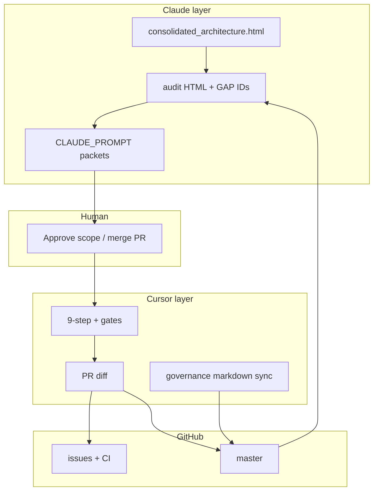

# ACP — Artifact Puzzle Map (Claude arch → execution)

**Document ID:** ACP-GOV-PUZZLE-001  
**Created:** 2026-06-24  
**Purpose:** Giải thích cách các mảnh ghép (HTML artifacts, markdown governance, Claude prompts, GitHub issues, Cursor execution) khớp với nhau.

---

## 1. Thứ bậc sự thật (DEVELOPMENT_PROTOCOL §3)

```text
ARCHITECTURE.md + 8 invariants
    ↓
Claude consolidated architecture (HTML) — decision matrix V1∪V2
    ↓
DEVELOPMENT_PROTOCOL.md — PACE, 9-step, smoke gate
    ↓
GitHub issues (acceptance criteria)
    ↓
docs/prompts/CLAUDE_PROMPT_*.md — task packets cho Cursor
    ↓
Code on master (actual behavior)
```

**Quy tắc audit nghiêm khắc:** Khi HTML artifact / issue title / Claude prompt **mâu thuẫn code**, code + `ARCHITECTURE.md` post-merge thắng — artifact cũ phải được đánh dấu **stale** hoặc reconciliation.

---

## 2. Lớp artifact và vai trò

| Lớp | File(s) | Owner | Output |
|-----|---------|-------|--------|
| **Architecture V3** | `ai_control_plane_consolidated_architecture.html` | Claude | 8 invariants, module tree, milestone A/B/C boundaries |
| **Workflow** | `cursor_workflow_prompt_system.html`, `cursor_workflow_continued.html` | Claude | Build order Milestone A; apex stubs |
| **Phase 2 audit** | `phase2_adjusted_prompts.html`, `PHASE2_SPRINT1_CONSOLIDATED_AUDIT_FINAL.md` | Claude + Cursor | P0 fixes, Path B merge, 38-item DoD |
| **Reconcile** | `cursor_claude_reconcile_analysis.html` | Claude | GAP-* IDs, 88% match narrative |
| **Telemetry / smoke** | `tab7_telemetry_spec_and_smoke_audit.html`, `CLAUDE_PROMPT_TAB7_TELEMETRY.md` | Claude | Hash-chain spec, SMK matrix |
| **Tool naming** | `CLAUDE_PROMPT_CONFIG_TOOL_NAMING.md` | Claude | P0-2b Option A decision |
| **Full audit (snapshot)** | `acp_full_audit_report.html` | Claude | Baseline `fc296d4` — **HISTORICAL ONLY** |
| **Reconciliation (live)** | `ACP_FULL_AUDIT_RECONCILIATION.md` | Cursor | master @ `de931b5` |
| **Audit prompts 1–3 final** | `ACP_AUDIT_PROMPTS_1_3_FINAL.md` | Cursor | Hygiene + HIGH/MED drift closed |
| **Public Beta** | `PUBLIC_BETA_SPRINT_PLAN.md`, `PUBLIC_BETA_GO_NO_GO.md` | Agent + human | PB-1..12 |
| **Sprint plans** | `MILESTONE_B_BACKLOG.md`, `MILESTONE_C_SPRINT_PLAN.md` | Agent + human | A/B/C CLOSED |
| **C+ ADR** | `MILESTONE_C_PLUS_ADR.md` | Claude + human | CLOSED PR #74 |

---

## 3. Claude prompts — map tới execution

### Phase 1 (đã thực hiện)

| Prompt | Issue | Delivered | PR / commit |
|--------|-------|-----------|-------------|
| `CLAUDE_PROMPT_TAB7_TELEMETRY.md` | #23 | `TelemetryWriter`, hash-chain, `InMemoryTelemetryStore` | Milestone A |
| `CLAUDE_PROMPT_SMOKE_AUDIT.md` | #25 | SMK-01..06c (8 tests), `scripts/smoke_acp.sh` | Milestone A/B |
| `CLAUDE_PROMPT_CONFIG_TOOL_NAMING.md` | #8 | `core/tool_names.py`, Option A adapter | PR #48 |

### `acp_full_audit_report.html` — 3 Cursor prompts (baseline `fc296d4`)

| Prompt | Intent @ snapshot | Execution status @ `de931b5` |
|--------|-------------------|------------------------------|
| **Cursor 1** — Close #8, #35, #45; label #37 | Issue hygiene | ✅ **Done** — PR #64; 0 open issues |
| **Cursor 2** — HIGH doc drift | API, stores, PHASE1 §4.2 | ✅ **Done** — PR #66, #75, #76 |
| **Cursor 3** — MED drift + MC breakdown | SMK, OS readiness, MC issues | ✅ **Done** — #52–#62 + C+ #67–#72 |

### Milestone C two-phase delivery

| Phase | PR | Scope |
|-------|-----|-------|
| **C-boundary** | #63 | MVP SAPAL wiring, `FileTelemetryStore`, `/apex/*` |
| **C+ depth** | #74 | `replay()`, Z-score, Argos, Darts/fallback, proposal-only act, cyanheads CI |

| HTML Prompt 3 vision | C-boundary @ #63 | C+ @ #74 |
|----------------------|------------------|----------|
| OTel / IsolationForest | Heuristic sense | Z-score + `otel-collector.yaml.example` |
| Argos 4-stage | Threshold analyze | `AnalyzeAdapter` Detect→Repair→Review→Mutate |
| Darts forecast | Heuristic predict | Darts optional + rolling fallback |
| Policy-gated act | Skip high risk | Option C proposal-only |
| replay API + cyanheads CI | `list_events` only | `replay()` + respx E2E |

**Kết luận puzzle @ `de931b5`:** HTML architect vision **delivered in C+**; boundary milestone **delivered in C**. See [`ACP_AUDIT_PROMPTS_1_3_FINAL.md`](ACP_AUDIT_PROMPTS_1_3_FINAL.md).

### Claude Prompt 3 (historical) vs MC issues — superseded

_Detail table retained for audit trail; live status = all CLOSED._

---

## 4. Pipeline PACE ↔ artifacts



**Deviation đã chấp nhận:** Path B monolithic PRs (#48, #63) thay Rule 1 "1 task = 1 PR" — documented in `PHASE2_SPRINT1_CONSOLIDATED_AUDIT_FINAL.md` (W1 waived).

---

## 5. Khi nào dùng artifact nào

| Câu hỏi | Đọc |
|---------|-----|
| Invariant có bị vi phạm không? | `ARCHITECTURE.md` + code |
| Milestone A/B/C đã xong chưa? | `MILESTONE_*_SPRINT_PLAN.md`, `ACP_FULL_AUDIT_RECONCILIATION.md` |
| Claude vision apex đầy đủ? | `acp_full_audit_report.html` pane ⑤ + `CLAUDE_PROMPT_MILESTONE_C_PLUS.md` |
| Cursor task tiếp theo? | `PUBLIC_BETA_SPRINT_PLAN.md` |
| Audit prompts 1–3 done? | `ACP_AUDIT_PROMPTS_1_3_FINAL.md` |
| Public Beta go/no-go? | `PUBLIC_BETA_GO_NO_GO.md` |
| Smoke / protocol gates? | `DEVELOPMENT_PROTOCOL.md` §5.5 |

---

**Supersedes:** Nothing. Complements `acp_full_audit_report.html` (historical @ `fc296d4`).

**Last updated:** 2026-06-24 @ `de931b5`
