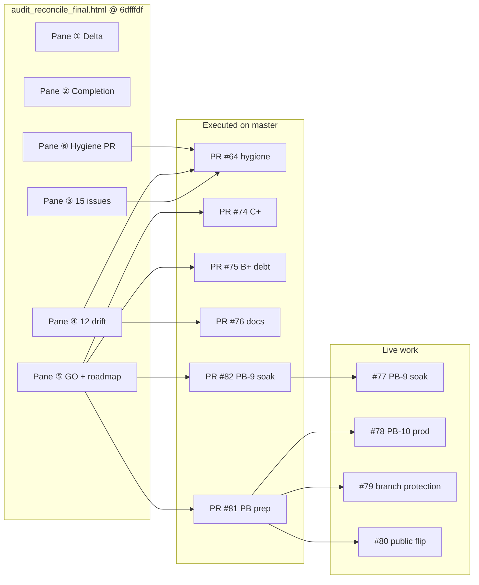

# Audit Reconcile Final — Live Status

**Document ID:** ACP-GOV-RECONCILE-FINAL-001  
**Artifact:** [`audit_reconcile_final.html`](audit_reconcile_final.html) (snapshot @ `6dfffdf`)  
**Code truth:** `master` @ `c5d52e5` (PR #82 — PB-9 soak started)  
**Related:** [`ACP_FULL_AUDIT_RECONCILIATION.md`](ACP_FULL_AUDIT_RECONCILIATION.md) · [`audit_reconcile_final_SNAPSHOT_README.md`](audit_reconcile_final_SNAPSHOT_README.md)

---

## 1. Đánh giá artifact

`audit_reconcile_final.html` là **bản reconcile chất lượng cao** giữa hai baseline audit:

| Nguồn | Baseline | Góc nhìn |
|-------|----------|----------|
| Claude | `fc296d4` | Doc drift methodology, pane ⑤ NO-GO architect-grade C |
| Cursor | `6dfffdf` | Code truth post PR #63, 15 OPEN issues, auto-close root cause |

**Giá trị lịch sử (vẫn hữu ích):**

- Giải thích **delta lớn nhất**: Claude 5% stubs vs Cursor 90% code sau PR #63.
- Ghi nhận **root cause** GitHub `Closes #52..#62` chỉ đóng #52 — process drift, không phải code thiếu.
- **Scope reductions** MC-4 / MC-8 / MC-10 — design choice, không failure — làm nền cho Milestone C+ ADR.
- Pane ⑥ là **executable hygiene packet** đã được team thực thi (PR #64 và các PR follow-on).

**Hạn chế @ thời điểm import:**

- Dừng ở post-#63; không biết C+ (#74), B+ debt (#75), Public Beta (#81–#82).
- Pane ② ghi governance 40% — **đã lỗi thời**.
- Pane ⑤ "What's next" — phần lớn **đã hoàn thành** hoặc chuyển sang PB issues.

**Verdict:** Giữ làm **audit trail** + reconcile narrative; **không** dùng pane ③⑥ cho planning — dùng bảng §3 bên dưới.

---

## 2. Liên hệ với hệ thống hiện tại

**Thứ bậc sự thật:** `ARCHITECTURE.md` + `master` → live governance markdown → HTML snapshots (historical).

---

## 3. Task scorecard — 6 panes → trạng thái @ `c5d52e5`

### Pane ① — Delta (Claude vs Cursor)

| Item | Artifact | Status | Evidence |
|------|----------|--------|----------|
| MC 5% vs 90% code | Resolved narrative | ✅ | PR #63 + C+ #74 |
| Auto-close #52–#62 | Process drift | ✅ Closed | PR #64 |
| 15 vs 5 OPEN issues | Cursor đúng @ snapshot | ✅ Superseded | 0 MC issues; #77–#80 PB only |
| 8 invariants intact | ✅ | ✅ | Reconciliation §6 |

### Pane ② — Completion %

| Dimension | @ `6dfffdf` (HTML) | @ `c5d52e5` (live) |
|-----------|-------------------|-------------------|
| Code A+B+C | ~90% | **100%** boundary + **C+ depth** |
| Governance | ~40% | **~95%** |
| Public Beta | Out of scope | **IN PROGRESS** — PB-1..6 done, PB-9 clock running |
| Tests | 156 | **165** pytest, **8/8** smoke |

### Pane ③ — Issue triage (15 → 4 debt @ artifact)

| Issue / item | Artifact verdict | Live status | PR / issue |
|--------------|------------------|-------------|------------|
| #53–#62 | Close (code done) | ✅ CLOSED | #64 |
| #37 | Close duplicate | ✅ CLOSED | #64 |
| #3 | Close stale | ✅ CLOSED | #64 |
| #13 | Narrow → public-beta | ✅ Narrowed / closed in hygiene | #64 |
| #39 | Close (5 fields OK) | ✅ CLOSED | #75 |
| #9 | KEEP debt | ✅ CLOSED | #75 — `model_profiles` on AppState + `/health` |
| MC-8 / #60 | KEEP debt → C+ | ✅ CLOSED | #74 — cyanheads respx E2E |
| MC-10 / #61 | KEEP debt → C+ | ✅ CLOSED | #74 — `otel-collector.yaml.example` |

**Open issues today:** #77 (PB-9), #78 (PB-10), #79 (PB-11), #80 (PB-12) only.

### Pane ④ — 12 doc drift items

| Severity | Count | Status |
|----------|-------|--------|
| HIGH (4) | ARCHITECTURE MC status, API surface, PHASE1 §4.2, MC sprint plan | ✅ PR #64, #66, #75, #76 |
| MED (5) | MB backlog, README, ARCHITECTURE §execution/mapping, SMK | ✅ PR #64, #76, #81 |
| LOW (3) | OS readiness, PHASE2 reports | ✅ PR #76, #81 |

### Pane ⑤ — Revised GO + roadmap

| Roadmap block | Artifact intent | Live status |
|---------------|-----------------|-------------|
| Immediate hygiene | Close issues + HIGH drift | ✅ PR #64, #66 |
| Short-term C+ | cyanheads, OTel, PolicyEngine, #9 | ✅ PR #74, #75 |
| Pre-Public Beta | legal, examples, OpenAPI, runbook, soak | ✅ Legal/examples/OpenAPI PR #81; soak **started** PR #82 |
| Public Beta gate | prod soak, OS gates, branch protection | ⏳ **#77–#80** |

**Scope reductions (MC-4/8/10):** Documented in artifact → **delivered or superseded** in C+ ADR (`MILESTONE_C_PLUS_ADR.md`); MC-4 = proposal-only Option C.

### Pane ⑥ — Combined hygiene Cursor prompt

| Part | Status | PR |
|------|--------|-----|
| PART 1 — GitHub hygiene | ✅ Executed (with variations: #60/#61 closed via C+, not relabeled debt) | #64, #74, #75 |
| PART 2 — ARCHITECTURE.md | ✅ | #64, #66, #75, #76 |
| PART 3 — Other docs | ✅ | #64, #76, #81 |
| Verify gates | ✅ Current: 165 pytest, 8/8 smoke | CI |

---

## 4. Tasks còn lại (từ artifact pane ⑤, mapped to PB)

Các mục artifact ghi "Pre-Public Beta" / "Public Beta gate" — **chưa xong** trên live:

| ID | Task | Owner | Blocker | Doc |
|----|------|-------|---------|-----|
| PB-9 | Staging soak ≥ 14 days | Ops | Time — started 2026-06-22, review **2026-07-06** | [`PB9_STAGING_SOAK_LOG.md`](PB9_STAGING_SOAK_LOG.md), #77 |
| PB-10 | Production soak ≥ 30 days | Ops | After PB-9 GO | #78, [`PUBLIC_BETA_GO_NO_GO.md`](PUBLIC_BETA_GO_NO_GO.md) |
| PB-11 | Branch protection API | Human | GitHub Team 403 on private org | #79 |
| PB-12 | Public repo flip | Human | PB-9 + PB-10 + checklist | #80 |
| PB-SEC | Update `SECURITY.md` contact email | Human | Before public flip | PR #81 note |
| PB-RUN | Full operational runbook | Optional debt | #13 scope — deploy/rollback/incident | Defer or narrow in PB sprint |

**Không mở lại** MC/C+ issues đã đóng trừ khi phát hiện regression.

---

## 5. Executive summary

| Question | Answer @ `c5d52e5` |
|----------|-------------------|
| Artifact còn dùng để plan không? | **Không** — dùng §4 + `PUBLIC_BETA_SPRINT_PLAN.md` |
| Artifact còn giá trị gì? | Audit trail, delta narrative, hygiene packet spec |
| Hygiene + drift từ artifact | **100% done** |
| C+ debt từ artifact | **100% done** (PR #74, #75) |
| Public Beta từ artifact roadmap | **~60%** — prep done, soak/flip pending |
| Safe to claim Public Beta? | **No** — chờ PB-9 soak + GO/NO-GO |

---

**Last updated:** 2026-06-22 @ `c5d52e5`
