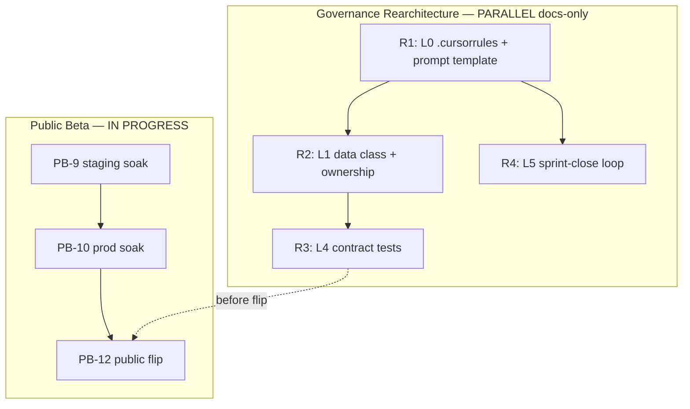

# Karpathy × ACP — 6-Layer Rearchitecture Plan

**Document ID:** ACP-GOV-KARPATHY-REARCH-001  
**Artifact:** [`karpathy_acp_rearchitecture_analysis.html`](karpathy_acp_rearchitecture_analysis.html)  
**Code truth:** `master` @ `c5d52e5`  
**Status:** **APPROVED FOR GOVERNANCE TRACK** — docs-only; parallel to Public Beta PB-O (soak), does not block #77–#80

---

## 1. Executive verdict

Karpathy's 4 principles (Think Before, Simplicity, Surgical, Goal-Driven) map to **Layer 0** of a 6-layer stack. ACP is **not** a greenfield rearchitecture — it is **~70% fit** with **one critical gap**:

| Layer | Name | ACP fit @ `c5d52e5` | Verdict |
|-------|------|---------------------|---------|
| **L0** | Behavioral constitution | **60%** | PACE exists; `.cursorrules` flat + **stale** (apex Milestone A guard) |
| **L1** | Project context | **85%** | `ARCHITECTURE.md` strong; missing ownership table + data classification |
| **L2** | Risk policy (Cursor) | **15% → 80%** | Was critical gap; **`CURSOR_RISK_POLICY.md` now seeded** |
| **L3** | Execution guardrails | **55%** | Branch rules exist; Path B waived; no LOC/file allowlist enforcement |
| **L4** | Evaluation | **90%** | 165 pytest, SMK 8/8, parity CI, pip-audit — artifact understated current L4 |
| **L5** | Governance memory | **70%** | Rich HTML archive; **`LESSONS_LEARNED.md` now seeded** |

**Root cause of historical drift** (validated): rules exist but are **not priority-ordered by layer**. Cursor silent-picks when flat `.cursorrules` conflicts with sprint urgency → monolithic PRs, doc PR scope creep, assumption drift.

**Rearchitecture type:** **Gap-fill + restructure** (~20–30% effort), **not** replacement of `ARCHITECTURE.md`, CI, or milestone artifacts.

---

## 2. Deep architecture analysis

### 2.1 Karpathy 4 principles vs ACP (pane ①)

| Principle | ACP has | Gap (validated live) |
|-----------|---------|----------------------|
| **Think Before** | PACE Plan phase in `DEVELOPMENT_PROTOCOL.md` | No structured **assumptions block** in prompts or `.cursorrules` |
| **Simplicity** | User rules + CONTRIBUTING "surgical" | No **LOC budget** or senior-engineer test in enforceable doc |
| **Surgical** | 8 invariants | No **per-task file allowlist**; orthogonal edits in doc PRs |
| **Goal-Driven** | SMK gates, verify in prompts | Strongest fit — formalize `verify: [command]` in every prompt template |

### 2.2 Six layers — what maps where

```text
L0  .cursorrules (behavior)     ← Karpathy 4 principles + assumption block
L1  ARCHITECTURE.md             ← module map, API, invariants (authority)
    DEVELOPMENT_PROTOCOL.md     ← PACE, 9-step, ownership of process
L2  CURSOR_RISK_POLICY.md       ← NEW: Cursor task classification (≠ policies.yml)
L3  BRANCH_PROTECTION.md        ← branch isolation + file allowlists + LOC caps
    .cursorrules §L3
L4  CI + pytest + smoke         ← ruff, mypy, parity, pip-audit
L5  docs/governance/*.html       ← Claude decision archive
    LESSONS_LEARNED.md           ← failure → rule loop
```

**Critical distinction:** `config/policies.yml` governs **runtime agents** (Restrict-PII, quotas). It is **not** L2 for Cursor. Mixing them caused the artifact's "30% L2 fit" diagnosis — accurate for **developer governance**, not agent policy.

### 2.3 What must NOT change (invariant stack)

1. `ARCHITECTURE.md` 8 invariants — **frozen** unless CRITICAL human-approved ADR.
2. `core/models.py` as SSOT for types.
3. Existing milestone closure records (A/B/C/C+ CLOSED).
4. Public Beta soak clock (PB-9) — **no code churn** during soak unless SEV-1.
5. Claude HTML artifacts — **L5 archive**, not deprecated.

### 2.4 Stale L1 finding (immediate)

Current `.cursorrules` lines 50–52 still require apex stubs for "Milestone A" — **contradicts** live code (SAPAL loop shipped PR #63, C+ PR #74). This is **L1 drift into L0** and must be fixed in Phase R1.

---

## 3. Important pieces (mảnh ghép quan trọng)

### 3.1 Keep as-is (high value, no redesign)

| Artifact | Layer | Role |
|----------|-------|------|
| `ARCHITECTURE.md` | L1 | Technical authority |
| `DEVELOPMENT_PROTOCOL.md` | L1/L4 | PACE + verify gates |
| CI workflow (pytest, smoke, parity) | L4 | Merge gate |
| `acp_full_audit_report.html`, `audit_reconcile_final.html` | L5 | Historical reconcile |
| `MILESTONE_C_PLUS_ADR.md` | L5 | C+ decision record |
| `PUBLIC_BETA_SPRINT_PLAN.md` | L5/Ops | Flip tracker |
| `config/policies.yml` | Runtime | Agent policy — **not** Cursor L2 |

### 3.2 Created @ governance import (this packet)

| Artifact | Layer | Status |
|----------|-------|--------|
| [`CURSOR_RISK_POLICY.md`](CURSOR_RISK_POLICY.md) | L2 | ✅ Seeded |
| [`LESSONS_LEARNED.md`](LESSONS_LEARNED.md) | L5 | ✅ Seeded (5 patterns) |
| [`karpathy_acp_rearchitecture_analysis.html`](karpathy_acp_rearchitecture_analysis.html) | L5 design | ✅ Snapshot |
| This plan | L5 live | ✅ |

### 3.3 Still to create (ordered)

| ID | Artifact | Layer | When | Effort |
|----|----------|-------|------|--------|
| **R1-A** | `.cursorrules` 6-section rewrite | L0/L3 | Phase R1 | ~2h docs |
| **R1-B** | `CLAUDE.md` top-level (optional) | L0 | Phase R1 | ~1h — single behavioral SSOT for Claude Code + Cursor |
| **R2-A** | `docs/DATA_CLASSIFICATION.md` | L1 | Pre-public flip | ~2h — PII fields for ABAC + test fixtures |
| **R2-B** | Ownership table in `ARCHITECTURE.md` | L1 | Phase R2 | ~1h — extract from `CURSOR_RISK_POLICY.md` |
| **R3-A** | `docs/CONTRACT_TESTS.md` + optional TS parity test | L4 | Pre-PB-12 | ~4h — PolicyEvalResponse schema lock |
| **R3-B** | Prompt template v2 (`docs/prompts/_TEMPLATE.md`) | L0/L2 | Phase R1 | ~1h — risk header + assumptions + allowlist |

---

## 4. Roadmap (lộ trình)

### Track separation



**Rule:** Governance track = **docs + CI test additions only** until PB-9 soak review (~2026-07-06). No `src/` changes except contract tests in R3 (MEDIUM, isolated PR).

### Phase R1 — L0 + L2 activation (Week 1, ~1 PR)

| Step | Action | Deliverable | Risk |
|------|--------|-------------|------|
| R1.1 | Rewrite `.cursorrules` → 6 sections per HTML pane ⑥ | PR `low/gov-r1-cursorrules-6layer` | LOW |
| R1.2 | Remove stale Milestone A apex stub guard | Same PR | LOW |
| R1.3 | Link `CURSOR_RISK_POLICY.md` + `LESSONS_LEARNED.md` from CONTRIBUTING | Same PR | LOW |
| R1.4 | Add `docs/prompts/_TEMPLATE.md` with assumptions block | Same PR | LOW |
| R1.5 | Pilot: 1 Cursor session — must state risk + assumptions before code | Human verify | — |

**Acceptance:** `.cursorrules` has L0–L5 headers; no contradiction with `ARCHITECTURE.md`; CONTRIBUTING references L2.

### Phase R2 — L1 completeness (Week 2, ~1 PR)

| Step | Action | Deliverable |
|------|--------|-------------|
| R2.1 | Add §Module ownership table to `ARCHITECTURE.md` | From `CURSOR_RISK_POLICY.md` |
| R2.2 | Create `docs/DATA_CLASSIFICATION.md` | PII: `data_category`, telemetry fields, fixture rules |
| R2.3 | `DEVELOPMENT_PROTOCOL.md` — add L2 triage step before Act | 1 paragraph + link |

### Phase R3 — L4 contract layer (Pre-PB-12, ~1–2 PRs)

| Step | Action | Deliverable |
|------|--------|-------------|
| R3.1 | `docs/CONTRACT_TESTS.md` — schema freeze list | `/policy/evaluate`, `/health`, `/identity/verify` |
| R3.2 | Optional: `tests/test_api_contract_snapshot.py` | JSON schema or golden files |
| R3.3 | `OPEN_SOURCE_READINESS.md` — check contract tests | Gate before public flip |

### Phase R4 — L5 closed loop (ongoing, every sprint close)

| Step | Action |
|------|--------|
| R4.1 | Run sprint-close checklist in `LESSONS_LEARNED.md` |
| R4.2 | New pattern → row in LESSONS_LEARNED → rule in L0/L2/L3 |
| R4.3 | Optional: drift tally per layer in sprint report |

---

## 5. Execution pipeline (sạch, dễ thực thi)

### 5.1 Per-task flow (Claude → Cursor)

```text
1. Claude writes prompt packet
   ├── L2 risk header: LOW | MEDIUM | HIGH | CRITICAL
   ├── File allowlist (from CURSOR_RISK_POLICY.md)
   ├── Assumptions block (empty → Cursor must fill before code)
   └── verify: [commands]

2. Cursor (mandatory pre-flight)
   ├── Classify risk — escalate if higher than prompt
   ├── State: files touched, assumptions, verify command
   └── If CRITICAL → stop until human approves

3. Cursor (execute)
   ├── Branch: {risk}/{issue}-{desc}
   ├── Respect LOC limit — split if exceeded
   └── Surgical: no orthogonal edits

4. Cursor (verify — L4)
   └── ruff → mypy → pytest → smoke → parity

5. PR
   ├── Individual Closes #N
   ├── Risk level + assumptions in body
   └── HIGH+: diff summary vs invariants

6. Merge → L5
   └── If incident/drift → LESSONS_LEARNED.md row
```

### 5.2 PR sizing matrix (enforce L3)

| Risk | Max net LOC | Max files | Split trigger |
|------|-------------|-----------|---------------|
| LOW | 50 | 5 | Any `src/` touch |
| MEDIUM | 200 | 10 | Multiple modules |
| HIGH | 300 | 15 | Multiple endpoints |
| CRITICAL | 300 | 10 | Any second concern → split |

### 5.3 Prompt template v2 (copy-ready)

```markdown
## Risk: [LOW|MEDIUM|HIGH|CRITICAL]
## File allowlist: [paths]
## Assumptions (Cursor fills before code):
- 
## Task:
...
## Verify:
ruff check src/ tests/
mypy src/ai_control_plane/ --strict
pytest tests/ -v
pytest tests/test_smoke.py -v -m smoke
```

---

## 6. Impact on existing artifacts (pane ③ validated)

| Artifact | Action |
|----------|--------|
| `.cursorrules` | **Restructure** (R1) — not delete |
| `ARCHITECTURE.md` | **Keep** + ownership table (R2) |
| `DEVELOPMENT_PROTOCOL.md` | **Keep** PACE + add L2 triage line |
| Claude HTML artifacts | **Keep** — L5 archive |
| Cursor prompt tabs | **Template v2** for new work only; old prompts historical |
| `policies.yml` | **Keep** — agent runtime only |
| Sprint reports | **Keep** + optional layer drift tally |
| `OPEN_SOURCE_READINESS.md` | **Keep** + contract test gate (R3) |
| `PHASE1_REPORT_V2.md` | **Keep** historical — no sync unless error found |

---

## 7. Risks of rearchitecture

| Risk | Mitigation |
|------|------------|
| Over-strict L2 blocks trivial fixes | LOW tier = no approval, ≤50 LOC |
| `.cursorrules` too long → ignored | 6 sections, priority header; link detail to `CURSOR_RISK_POLICY.md` |
| Parallel PB soak + governance PR noise | Governance = docs-only until soak review |
| Duplicate rules across files | L0 = behavior only; L2 = classification; L3 = allowlists |

---

## 8. Success criteria

| Metric | Target |
|--------|--------|
| Post-R1 Cursor sessions | Assumptions stated in first reply |
| PRs mixing risk levels | 0 (after R1) |
| Doc-only PRs touching `src/` | 0 |
| `.cursorrules` contradicts ARCHITECTURE | 0 (apex stub removed) |
| LESSONS_LEARNED patterns without rule mapping | 0 |

---

## 9. Immediate next action (human)

1. **Approve Phase R1 PR** — `.cursorrules` 6-layer rewrite (use HTML pane ⑥ as draft).
2. **Continue PB-9 soak** — no conflict.
3. **Use `_TEMPLATE.md`** for all new Cursor prompts after R1 merges.

---

## 10. Related documents

- Snapshot: [`karpathy_acp_rearchitecture_analysis_SNAPSHOT_README.md`](karpathy_acp_rearchitecture_analysis_SNAPSHOT_README.md)
- Puzzle map: [`ACP_ARTIFACT_PUZZLE_MAP.md`](ACP_ARTIFACT_PUZZLE_MAP.md)
- Public Beta: [`PUBLIC_BETA_SPRINT_PLAN.md`](PUBLIC_BETA_SPRINT_PLAN.md)

**Last updated:** 2026-06-22 @ `c5d52e5`
