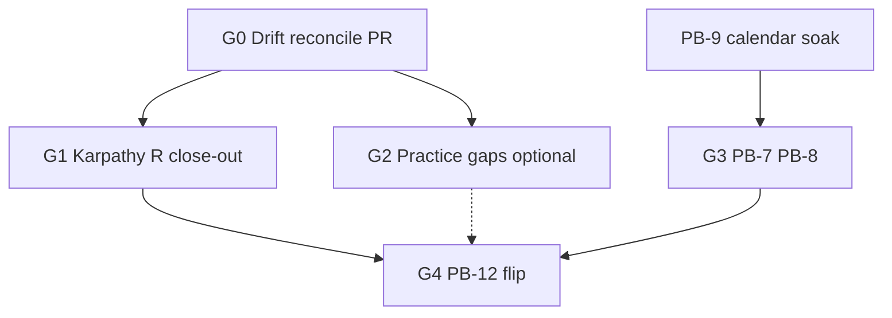

# Governance & Public Beta — Next phase plan (post Studies 01–07)

**Document ID:** ACP-GOV-NEXT-PHASE-001  
**Created:** 2026-06-25  
**Prerequisite:** [`GOVERNANCE_DRIFT_RECONCILIATION.md`](GOVERNANCE_DRIFT_RECONCILIATION.md)  
**Operator evidence:** [`practice-evidence/PRACTICE_STUDIES_AUDIT_01-07.md`](practice-evidence/PRACTICE_STUDIES_AUDIT_01-07.md)

---

## 1. North star

```text
Close governance DRIFT (HTML ↔ master)
    → Complete Karpathy R1-B + L2/L5 enrichment
    → Continue PB-9 calendar soak (unchanged clock)
    → Close optional practice gaps (5g, 5e, 07b)
    → PB-7..PB-8 hardening
    → PB-12 public flip (human go/no-go)
```

**Parallel tracks:** PB-9 soak **must not block** docs-only governance PRs (LOW risk).

---

## 2. Phase map

| Phase | ID | Goal | Risk | Blocks PB-12? |
|-------|-----|------|------|---------------|
| **G0** | Reconcile | Drift doc + LESSONS merge + CURSOR_RISK + CLAUDE.md + `.cursorrules` | LOW | No |
| **G1** | Karpathy close-out | R1-B, R4 sprint-close automation | LOW | No |
| **G2** | Practice gaps | 5g kill switch, 5e stale image, 07b Mac witness | LOW–MED | No |
| **PB** | Soak calendar | `PB9_STAGING_SOAK_LOG.md` daily → ~2026-07-06 | Ops | **Yes** (PB-10/12) |
| **G3** | Pre-flip technical | PB-7 README verify, PB-8 rc tag, CONTRACT_TESTS | MED | Partial |
| **G4** | Go public | PB-12 human approve | CRITICAL | — |

---

## 3. Phase G0 — Drift closure ✅ COMPLETE

**Merged:** PR [#90](https://github.com/DataXMind/AI-Control-Plane/pull/90) → `master` @ `c6e8cc1` (2026-06-25)  
**Branch (historical):** `low/gov-drift-reconcile-post-studies`  
**Verify:** docs-only; `git diff --name-only master | grep '^src/'` → 0

| Task | ID | Deliverable | Acceptance |
|------|-----|-------------|------------|
| Drift reconciliation doc | G0-1 | `GOVERNANCE_DRIFT_RECONCILIATION.md` | ✅ This packet |
| Next phase plan | G0-2 | `GOVERNANCE_NEXT_PHASE_PLAN.md` | ✅ This file |
| Merge LESSONS P-01..P-12 | G0-3 | `LESSONS_LEARNED.md` | All HTML P-01..P-07 + repo patterns + P-11/P-12 |
| Enrich CURSOR_RISK | G0-4 | `CURSOR_RISK_POLICY.md` | F8–F10, PR template, waiver § |
| Create `CLAUDE.md` | G0-5 | Root `CLAUDE.md` | Karpathy 4 + correct governance paths |
| Refresh `.cursorrules` | G0-6 | L1/L5 pointers, F7/F9, date | Links practice-evidence + audit pack |
| Update puzzle map | G0-7 | `ACP_ARTIFACT_PUZZLE_MAP.md` | HTML artifact supersession + Studies |
| Update Karpathy plan | G0-8 | `ACP_KARPATHY_REARCHITECTURE_PLAN.md` | R1-B status, L4/L5 % post studies |

**PR title:** `docs: governance drift reconciliation post Studies 01-07`

---

## 4. Phase G1 — Karpathy R-track completion ✅ COMPLETE @ #91–#96

| Task | ID | Source | Status |
|------|-----|--------|--------|
| Sprint-close LESSONS mandatory | G1-1 | P-05, P-07 | ✅ `DEVELOPMENT_PROTOCOL.md` §5.6 Evolve |
| Prompt template v2 audit | G1-2 | R3-B | ✅ `_TEMPLATE.md` + `SESSION_ANCHOR_TEMPLATE` (#91) |
| Quarterly LESSONS review | G1-3 | HTML maintenance § | Calendar: **2026-09** (pending) |
| `GOV_6LAYER_AUDIT_PASS.md` addendum | G1-4 | Post-studies L4 proof | ✅ @ `638250c` addendum |

**Merged:** #91 ML5 · #93 CLI gov · #94 CURSOR_RISK · #95 CLAUDE.md · #96 LESSONS

---

## 5. Phase G2 — Optional practice gaps (from audit §2)

| Task | ID | Runbook | Priority |
|------|-----|---------|----------|
| Kill switch drill 5g | G2-1 | `study-05-advanced-surprises/RUNBOOK.md` §5g | Medium | ✅ G2-1 @ 2026-06-26 |
| Docker stale image 5e | G2-2 | Edit `GOVERNANCE_VERSION` + rebuild | Low | ✅ 05e-r @ 2026-06-26 |
| Study 07b Mac witness | G2-3 | `study-07-cross-network/TOPOLOGY` §07b | Low | ⏸ **WAIVED** — G-03 closed via G2-4 |
| Study 07 negative LAN log | G2-4 | `terminal-7-0n-negative-lan.md` | Low | ✅ G2-4 @ 2026-06-26 |
| Shipped config remote (Study 08) | G2-5 | `study-08-shipped-remote/RUNBOOK.md` | Optional | ✅ G2-5 @ 2026-06-26 |

Evidence → `practice-evidence/study-NN-*/RESULTS.md` + audit pack §14.4.

---

## 6. Phase PB — Public Beta soak (unchanged)

| Item | Status | Owner action |
|------|--------|--------------|
| PB-9 staging soak ≥14d | 🔄 IN PROGRESS since 2026-06-22 | Daily `soak_staging.sh` log |
| Review target | ~2026-07-06 | [`PUBLIC_BETA_GO_NO_GO.md`](PUBLIC_BETA_GO_NO_GO.md) |
| Study 07 remote soak | ✅ One iteration | Does **not** replace calendar |

**Invariant:** No src/ churn during soak unless SEV-1 (Karpathy plan §2.3).

---

## 7. Phase G3 — Pre-flip technical (PB-7..PB-8)

| ID | Item | Verify |
|----|------|--------|
| G3-1 | PB-7 README ≤15 min fork | Operator run on clean machine | 🔄 **RUNBOOK** | [`pb-7-clean-machine-fork/RUNBOOK.md`](practice-evidence/pb-7-clean-machine-fork/RUNBOOK.md) |
| G3-2 | PB-8 `v0.1.0-rc.1` tag plan | `CHANGELOG.md` + human approve |
| G3-3 | CONTRACT_TESTS parity | `docs/CONTRACT_TESTS.md` + CI |
| G3-4 | PB-11 branch protection | Deferred — org plan at PB-12 |

---

## 8. Phase G4 — Public flip (PB-12)

**CRITICAL — human explicit approve required.**

Checklist source: [`PUBLIC_BETA_GO_NO_GO.md`](PUBLIC_BETA_GO_NO_GO.md)

Pre-conditions:
- PB-9 calendar PASS
- G0 drift reconciliation merged ✅ (#90)
- Practice audit pack on master ✅ (#89)
- No open HIGH governance drift items (see [`GOVERNANCE_NEXT_PHASE_PRE_APPROVAL_AUDIT.md`](GOVERNANCE_NEXT_PHASE_PRE_APPROVAL_AUDIT.md) §6 meta-drift)

---

## 9. Task dependency graph



---

## 10. Ownership & risk classification

| Phase | Default risk | Reviewer |
|-------|--------------|----------|
| G0, G1 | LOW | Self + CI |
| G2 | LOW (docs) / MEDIUM (if src for 5g) | Claude if MEDIUM |
| PB-9 | Ops | Human log review |
| G3 | MEDIUM | Human spot-check README |
| G4 | CRITICAL | Human approve |

---

## 11. Success metrics

| Metric | Target |
|--------|--------|
| LESSONS patterns without rule mapping | 0 |
| HTML artifact claims without reconciliation note | 0 |
| `CLAUDE.md` exists at root | Yes after G0-5 |
| CS-05 calendar soak | PASS by 2026-07-06 |
| Practice Studies documented | 01–07 PASS on master |

---

## 12. Pre-approval audit (operator review before G1+)

**Harsh audit packet:** [`GOVERNANCE_NEXT_PHASE_PRE_APPROVAL_AUDIT.md`](GOVERNANCE_NEXT_PHASE_PRE_APPROVAL_AUDIT.md)  
**Rule:** Do not start G1–G4 execution until maintainer signs §11 approval gates.

**Last updated:** 2026-06-26 @ G1 complete (#91–#96); G2/PB-9/G3 pending operator
