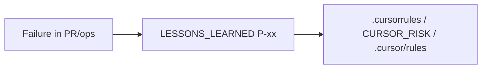

# L5 Governance Memory — Maturity Model

**Document ID:** ACP-GOV-L5-MATURITY-001  
**Layer:** L5 — Governance & Memory  
**Framework:** Karpathy 6-layer · complements [`ACP_KARPATHY_REARCHITECTURE_PLAN.md`](ACP_KARPATHY_REARCHITECTURE_PLAN.md)

---

## Purpose

Define **Maturity Levels 0–5 (ML0–ML5)** for **agent conversation memory** — how reliably context survives across sessions, agents, and operators.

**Project target:** **ML5** before Public Beta flip (PB-12), alongside PB-9 soak PASS.

---

## Level definitions

| Level | Name | Characteristics | ACP status |
|-------|------|-----------------|------------|
| **ML0** | Ad-hoc chat | No structured rules; context lost between sessions | Pre-R1 |
| **ML1** | Flat rules | Single `.cursorrules` list, no layer priority | Pre-Karpathy |
| **ML2** | 6-layer + L2 risk | `.cursorrules` L0–L5, `CURSOR_RISK_POLICY.md`, `LESSONS_LEARNED.md` seeded | R1–R3 |
| **ML3** | Protocol + runtime | `DEVELOPMENT_PROTOCOL.md` PACE; `GET /governance/status`; CS catalog | PR #86 |
| **ML4** | Operator evidence | Studies 01–07, practice audit, drift reconciliation | Post #89–#90 |
| **ML5** | **Durable agent memory** | `.cursor/rules/`, `AGENTS.md`, session anchor, CI gate, exportable gold pattern | **This pack** |

---

## ML5 acceptance checklist (project target)

| # | Criterion | Evidence |
|---|-----------|----------|
| M5-1 | `AGENTS.md` at repo root — single agent entry | File exists |
| M5-2 | `.cursor/rules/*.mdc` — scoped, &lt;50 lines each, frontmatter valid | ≥4 rule files |
| M5-3 | `docs/prompts/SESSION_ANCHOR_TEMPLATE.md` — mandatory session open | File exists |
| M5-4 | `scripts/verify_governance_memory.sh` — local + CI | Exit 0 |
| M5-5 | `governance_catalog.py` `doc_links` includes memory paths | API `/governance/status` |
| M5-6 | `DEVELOPMENT_PROTOCOL.md` Evolve → `LESSONS_LEARNED.md` mandatory | §5.6 |
| M5-7 | Gold pattern **GP-01** published under `docs/governance/gold-patterns/` | Public export ready |
| M5-8 | `CONTRIBUTING.md` + puzzle map link memory pack | Onboarding |

**CI job:** `governance-memory` in [`.github/workflows/ci.yml`](../../.github/workflows/ci.yml).

---

## Three memory tiers (ML5 operating model)

```text
Tier A (auto)     .cursorrules + .cursor/rules/ + user rules
Tier B (session)  SESSION_ANCHOR_TEMPLATE + @files + issue/PR
Tier C (durable)  LESSONS + practice-evidence + phase plans + soak logs
```

**Rule:** Tier C wins over chat. Tier A+B load every session; Tier C is written at sprint close.

---

## Feedback loop (L5 → L0–L3)



Quarterly review: first calendar **2026-09** (G1-3).

---

## Relation to Public Beta

| PB gate | ML5 relevance |
|---------|----------------|
| PB-9 soak | Logged in `PB9_STAGING_SOAK_LOG.md` (Tier C), not chat |
| PB-12 flip | ML5 checklist M5-1..M8 green + human go/no-go |
| Open source | Ship **GP-01** for adopters — memory without vendor lock-in |

---

## Verify ML5 locally

```bash
bash scripts/verify_governance_memory.sh
pytest tests/test_governance_memory.py -v
```

---

**Last updated:** 2026-06-25 · Target: ML5 @ memory pack merge
