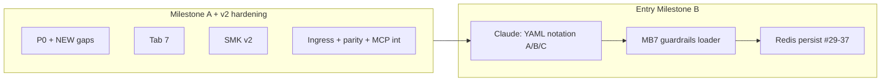

# Báo cáo tổng hợp Phase 1 v2 — AI Control Plane

**Document ID:** ACP-GOV-PHASE1-V2  
**Version:** 2.0  
**Status:** ACTIVE (supersedes narrative in chat-only Phase 1 v1 report)  
**Baseline:** `master` post Milestone A close (#38)  
**Method:** Đối chiếu 6 artifact HTML Claude + code audit độc lập + remediation Phase 1 v2

**Related:**

| Artifact | Path |
|----------|------|
| Phase 1 v1 (chat) | Agent transcript 2026-06-23 — optimistic on integration |
| Claude HTML archive | [`docs/governance/*.html`](.) |
| Development protocol | [`docs/DEVELOPMENT_PROTOCOL.md`](../DEVELOPMENT_PROTOCOL.md) |
| Milestone B backlog | [`MILESTONE_B_BACKLOG.md`](MILESTONE_B_BACKLOG.md) |

---

## 1. Executive summary

| Question | Answer |
|----------|--------|
| Đóng #38 có hợp lý? | **Có** — nếu scope = PoC scaffold, không phải production |
| Báo cáo v1 có sai? | **Có phần** — overclaim coverage/integration; understate tool naming + YAML parity |
| Phase 1 v2 đã làm gì? | Ingress normalize, MCP→policy map, shipped parity CI, MCP real-policy test, docs honest |

---

## 2. Timeline & commits (unchanged)

```
629c39f  Milestone A scaffold
4d7408d  P0-1 models/registry/telemetry
1bd9254  NEW-5 load_policies adapter
8b59189  P0-2 PolicyEngine from YAML
e0461fc  NEW-3/4 apex stubs
bc5ea40  NEW-2 fixture unify + smoke
5585fc5  Tab 7 telemetry + SMK v2 + CI
9196ee5  MCP tests + S4 A1 + debt → #38 close
1796c33  Governance HTML archive
[Phase 1 v2]  ingress normalize + parity tests + governance v2
```

---

## 3. Verdict matrix — v1 vs v2

| Hạng mục | v1 claim | v2 verdict |
|----------|----------|------------|
| Tab 7 telemetry | APPROVED | ✅ Confirmed |
| SMK v2 | Implemented | ✅ Confirmed (fixture config) |
| P0-2 tool naming | "Runtime OK" | ⚠️ **Partial** — loader OK; ingress/MCP gap fixed in v2 |
| Config-driven governance | Full | ⚠️ **RBAC + ABAC subset**; guardrails/kill_switch not loaded |
| 82 tests / "full core coverage" | ✅ | ❌ **No coverage floor**; integration folder empty until v2 tests |
| structlog everywhere | ✅ in DoD | ⚠️ **api/ + mcp/** only — `.cursorrules` aspirational |
| pre-commit in DoD | ✅ | ⚠️ File exists; CI runs ruff/mypy directly |
| MCP E2E policy | Implied | ❌ v1 mocked HTTP — v2 adds `test_mcp_policy_integration.py` |
| Shipped `config/` CI | Not stated | ❌ v1 CI used fixtures only — v2 adds parity job |
| 88% reconcile | Echo | ❓ Not measurable — use gap list below |

---

## 4. Gap list (honest record)

### 4.1 Closed in Phase 1 v2

| ID | Gap | Fix |
|----|-----|-----|
| GAP-TN-1 | API ingress không normalize `tool_name` | `resolve_policy_tool_name()` in `policy_evaluate` |
| GAP-TN-2 | MCP tools ≠ policy actions (`git_status` vs `git_read`) | `MCP_TOOL_TO_POLICY_ACTION` + MCP policy payload |
| GAP-CFG-1 | CI không test shipped `config/` | `test_shipped_config_parity.py` + CI step |
| GAP-INT-1 | MCP tests mock policy | `test_mcp_policy_integration.py` (ASGITransport) |
| GAP-DOC-1 | Guardrails/ABAC subset undocumented | `ARCHITECTURE.md` § policies.yml loading |
| GAP-DOC-2 | Overclaim coverage/structlog | Corrected in protocol + this report |
| GAP-TN-3 | Shipped YAML dot notation (architect A/B/C) | P2-0 Option A — `core/tool_names.py` permanent adapter |
| GAP-GR-1 | `guardrails:` not loaded | MB-S1-1 — `load_guardrails()` |
| GAP-GR-2 | `kill_switch` not enforced | MB-S1-1 — `load_kill_switch()` + PolicyEngine |
| GAP-ABAC-1 | `approval_status`, `role_not_in`, `read_only` skipped | MB-S1-2 — ConditionEvaluator |
| GAP-ABAC-2 | Restrict-PII partial map (drops `role_not_in`) | MB-S1-2 + shipped parity test |
| GAP-ID-1 | Identity failures 503; no SMK-06 | MB-S1-5 — JWT stub + 401 contract |
| GAP-Q-1 | `quotas.by_model_profile` / `by_agent` | MB-S2-11 — `load_agent/model_profile_token_limits()` + GET `/quota/agent` + `/quota/profile` (PR #51) |

### 4.2 Still open (defer)

| ID | Gap | Target |
|----|-----|--------|
| GAP-S4-1 | `load_model_profiles()` not wired to AppState | B+ debt — #9 open; quota loaders sufficient for runtime |
| GAP-BP-1 | Branch protection (org free tier) | Team discipline |
| GAP-CC-1 | Codecov opt-in only | See §8 |

---

## 5. Architecture V3 — scaffold vs plan

| V3 item | Milestone A | Notes |
|---------|-------------|-------|
| `core/` + `api/server.py` | ✅ | 12+ HTTP routes (see ARCHITECTURE §API surface) |
| `load_policies()` adapter | ✅ | rbac + abac full (MB-S1-2) |
| Tab 7 telemetry | ✅ | + FileTelemetryStore (MC-9 / PR #63) |
| `mcp/git_server.py` | ✅ | + HTTP transport + factory (MB-S2) |
| `mcp/server_factory.py` | ✅ | Milestone B Sprint 2 |
| apex/ SAPAL | ✅ | MVP loop live (PR #63); C+ depth deferred |
| CLI assign/status | ✅ | approve/quota/logs/apex live (HTTP-only) |
| Tests ~12 files plan | ✅ | 156 pytest @ master post MC |

---

## 6. Eight invariants — compliance

| # | Invariant | Status |
|---|-----------|--------|
| 1 | Custom PolicyEngine | ✅ |
| 2 | models.py owns contracts | ✅ |
| 3 | MCP facade only | ✅ |
| 4 | CLI HTTP only | ✅ |
| 5 | apex owns SAPAL | ✅ MVP loop (PR #63); OSS adapters = C+ |
| 6 | api/ TS bridge | ✅ |
| 7 | QuotaStore swappable | ✅ Redis when `ACP_REDIS_URL` set |
| 8 | config/ + ACP_CONFIG_DIR | ✅ + shipped parity CI v2 |

---

## 7. Pipeline position (post Phase 1 v2)



---

## 8. Codecov — role in this project

**What it is:** Optional CI step uploading `coverage.xml` to [codecov.io](https://codecov.io) when repo variable `CODECOV_ENABLED=true` and `CODECOV_TOKEN` secret are set.

**What it does here:**

- Visualize line coverage per PR (`pytest --cov=ai_control_plane`)
- Track coverage trend over time
- PR comments showing uncovered lines (when enabled)

**Value for AI Control Plane:**

| Benefit | Relevance |
|---------|-----------|
| Catch untested policy paths | **High** — `core/policies.py` is high-risk |
| Enforce floor over time | **Medium** — `fail_under=70` since MB-S1-3 |
| Public beta signal | **Medium** — shows test discipline to contributors |

**Current state:** `CODECOV_ENABLED=true` and `CODECOV_TOKEN` configured on GitHub (2026-06-23). Baseline ~64.5% at `83e3ab5`; Sprint 1 branch ~82% with `fail_under=70`. See [`PHASE2_SPRINT1_REPORT.md`](PHASE2_SPRINT1_REPORT.md).

**Not a substitute for:** SMK-01..05, shipped parity tests, or policy integration tests.

---

## 9. Verify gate (Phase 1 v2)

**Result (Phase 1 v2 baseline):** 91 pytest · SMK 5/5 · ruff · mypy strict · shipped parity 4 tests.  
**Result (Sprint 1 branch):** 124 pytest · SMK 8/8 · shipped parity 5 tests · see [`PHASE2_SPRINT1_REPORT.md`](PHASE2_SPRINT1_REPORT.md).

```bash
ruff check src/ tests/
mypy src/ai_control_plane/ --strict
pytest tests/ -v
pytest tests/test_smoke.py -v -m smoke
pytest tests/test_shipped_config_parity.py -v -m shipped_config
```

**Env:** Default tests use `tests/fixtures/config` (conftest autouse). Shipped parity overrides `ACP_CONFIG_DIR=config/`.

---

## 10. Claude artifacts — role unchanged

| HTML | Role |
|------|------|
| consolidated_architecture | V3 union decision |
| cursor_workflow_* | Build order |
| phase2_adjusted_prompts | P0 audit |
| cursor_claude_reconcile | Gap reconciliation |
| tab7_telemetry_spec | Tab 7 + SMK |

v2 does not invalidate Claude audits — it **narrows** what "done" means for Milestone A and records remediation.

---

## 11. Changelog v1 → v2

| Section | Change |
|---------|--------|
| Executive | Honest PoC vs production framing |
| Gaps | Explicit GAP-* IDs + v2 fixes |
| Tool naming | Ingress + MCP map documented |
| YAML loading | guardrails/ABAC limits table |
| Tests | Shipped parity + MCP integration |
| Codecov | §8 dedicated |
| Milestone B | MB7 backlog file |

---

**Last updated:** 2026-06-24 (post Milestone B/C; GAP-Q-1 closed MB-S2-11)  
**Owner:** DataXMind maintainers  
**Next human action:** Send [`PHASE1_CONSOLIDATED_FOR_CLAUDE.md`](PHASE1_CONSOLIDATED_FOR_CLAUDE.md) to Claude → Phase 2 pack + P0-2b verdict
