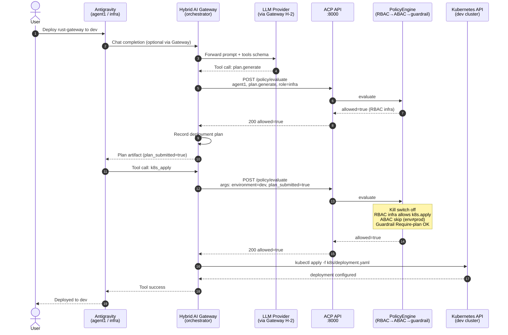
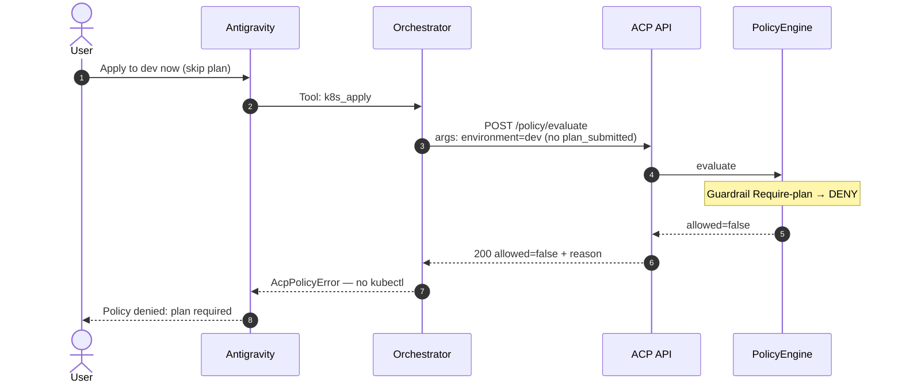
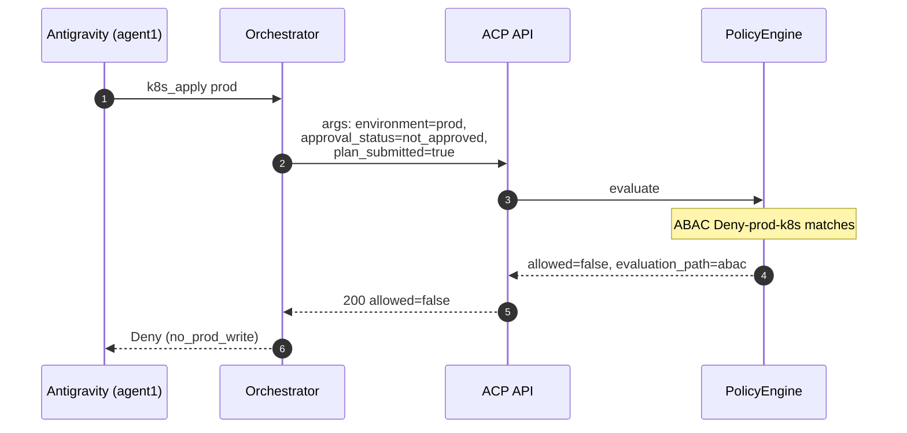
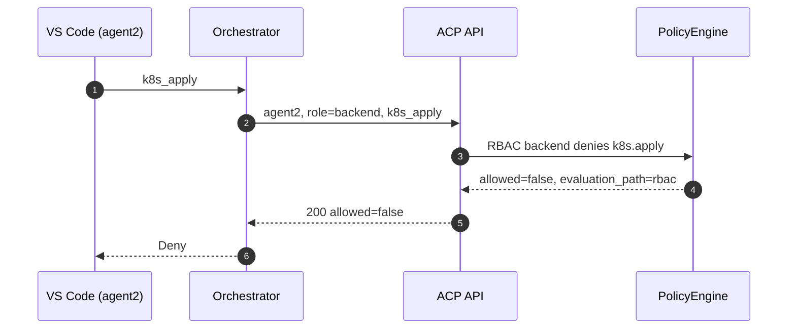
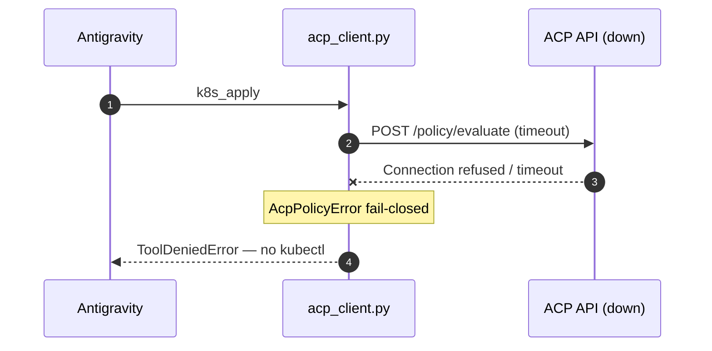
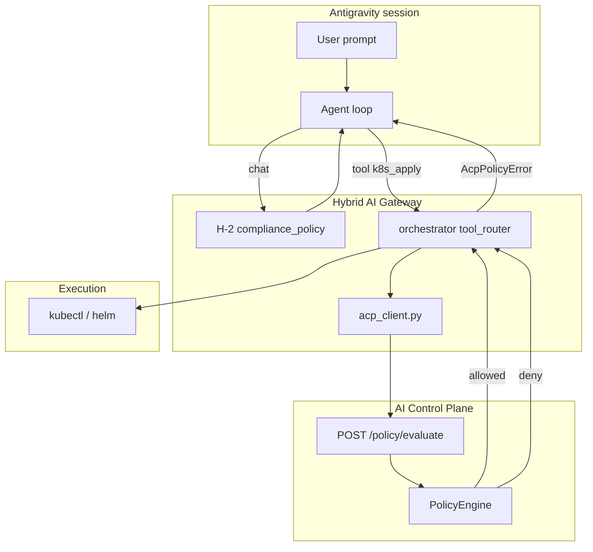

# Hybrid AI Gateway — `orchestrator/acp_client.py` PR spec (SSOT)

**Document ID:** ACP-INTEG-HYBRID-GATEWAY-PR-SPEC-001  
**Audience:** Hybrid-AI-Gateway maintainers · Antigravity integrators  
**Target repo:** [DataXMind/Hybrid-AI-Gateway](https://github.com/DataXMind/Hybrid-AI-Gateway)  
**ACP companion:** [`HYBRID_AI_GATEWAY.md`](HYBRID_AI_GATEWAY.md) · [`CLIENT_INTEGRATION.md`](../CLIENT_INTEGRATION.md)  
**Sample code (ACP):** [`examples/integrate/python/gateway_antigravity_hook.py`](../../examples/integrate/python/gateway_antigravity_hook.py)

> **Purpose:** Canonical PR specification for the first gateway-side ACP client module.  
> Copy this file (or link) when opening the PR in Hybrid-AI-Gateway. ACP does **not** implement gateway code.

---

## 1. PR metadata

| Field | Value |
|-------|-------|
| **Title** | `feat(orchestrator): ACP policy client — fail-closed before tool dispatch` |
| **Branch** | `feat/orchestrator-acp-client` |
| **Labels** | `integration`, `security`, `spec-gap` |
| **Risk** | LOW — thin HTTP client, no ACP package import |
| **Blocks** | Tool router / Antigravity wrapper wiring |
| **Out of scope** | Rust `rust-gateway` middleware (follow-up PR) |

---

## 2. Problem

Tool dispatch in the gateway (orchestrator, Antigravity hooks) lacks a **single choke point** that calls ACP before executing `k8s_apply`, `git_read`, etc. ACP is hosted separately with a Python sample; the gateway needs a reusable, testable, env-driven module.

**ACP invariant:** Gateway must **not** import `ai_control_plane` — HTTP-only via `ACP_API_URL`.

---

## 3. Solution

Add `orchestrator/acp_client.py` — thin wrapper around `POST /policy/evaluate` with **fail-closed** semantics (timeout / 5xx / connection error → deny).

### File layout

```text
orchestrator/
├── acp_client.py          # NEW — public API
├── acp_client_test.py     # NEW — unit tests (respx / pytest-httpx mock)
└── __init__.py            # optional: export acp_allow_tool
```

---

## 4. Public API (proposed)

```python
# orchestrator/acp_client.py

from __future__ import annotations

import os
from dataclasses import dataclass
from typing import Any

import httpx

DEFAULT_TIMEOUT_S = 2.0
DEFAULT_PROJECT_ID = "rust-gateway"


@dataclass(frozen=True)
class AcpConfig:
    """Resolved from env — no hardcoded host."""

    api_url: str
    default_project_id: str
    default_agent_id: str | None
    timeout_s: float

    @classmethod
    def from_env(cls) -> AcpConfig:
        return cls(
            api_url=os.environ.get("ACP_API_URL", "http://127.0.0.1:8000").rstrip("/"),
            default_project_id=os.environ.get("ACP_PROJECT_ID", DEFAULT_PROJECT_ID),
            default_agent_id=os.environ.get("ACP_AGENT_ID"),
            timeout_s=float(os.environ.get("ACP_TIMEOUT_S", DEFAULT_TIMEOUT_S)),
        )


class AcpPolicyError(PermissionError):
    """Policy deny or fail-closed (ACP unreachable)."""

    def __init__(
        self,
        message: str,
        *,
        http_status: int | None = None,
        body: dict | None = None,
    ) -> None:
        super().__init__(message)
        self.http_status = http_status
        self.body = body or {}


def acp_allow_tool(
    *,
    agent_id: str,
    tool_name: str,
    role: str,
    project_id: str | None = None,
    args: dict[str, Any] | None = None,
    config: AcpConfig | None = None,
    client: httpx.Client | None = None,
) -> dict[str, Any]:
    """
    Call POST /policy/evaluate. Return JSON body on allow.
    Raise AcpPolicyError on deny, timeout, or HTTP error (fail-closed).
    """
    ...


def acp_health_ok(*, config: AcpConfig | None = None) -> bool:
    """GET /health — worker startup gate. False on any failure."""
    ...
```

### Design decisions

| Decision | Rationale |
|----------|-----------|
| `AcpPolicyError` subclasses `PermissionError` | Orchestrator can `except PermissionError` at tool-runner boundary |
| Optional `args` dict | Pass `environment`, `plan_submitted`, `approval_status` for ABAC / guardrails |
| `AcpConfig.from_env()` | Single env resolution point; easy injection in tests |
| Optional `httpx.Client` | Connection pooling for multi-tool sessions |
| No allow-cache | Each tool invocation = fresh evaluate (audit + kill-switch safe) |

**Reference implementation:** copy semantics from [`gateway_antigravity_hook.py`](../../examples/integrate/python/gateway_antigravity_hook.py) and extend with `args` + `AcpConfig`.

---

## 5. Environment variables

| Variable | Required (prod) | Default | Example |
|----------|-----------------|---------|---------|
| `ACP_API_URL` | Yes | `http://127.0.0.1:8000` | `http://<your-acp-host>:8000` (Tailscale/LAN) |
| `ACP_PROJECT_ID` | No | `rust-gateway` | `rust-gateway` |
| `ACP_AGENT_ID` | No | — | `agent1` (Antigravity infra) |
| `ACP_TIMEOUT_S` | No | `2.0` | `3.0` on slow tailnet |

**Docker Compose (gateway staging):**

```yaml
services:
  orchestrator:
    environment:
      ACP_API_URL: http://acp.internal:8000
      ACP_PROJECT_ID: rust-gateway
      ACP_AGENT_ID: agent1
```

---

## 6. Integration point (orchestrator tool router)

```python
# orchestrator/tool_router.py (illustrative — wire in follow-up PR)

from orchestrator.acp_client import AcpPolicyError, acp_allow_tool


def dispatch_tool(*, agent_id: str, role: str, tool_name: str, tool_args: dict) -> None:
    try:
        acp_allow_tool(
            agent_id=agent_id,
            tool_name=tool_name,
            role=role,
            args=tool_args,
        )
    except AcpPolicyError as exc:
        raise ToolDeniedError(str(exc)) from exc
    run_subprocess(tool_name, tool_args)
```

### Antigravity agent mapping (shipped ACP config)

| Runner | `agent_id` | `role` | Typical tools |
|--------|------------|--------|---------------|
| Antigravity | `agent1` | `infra` | `k8s_apply`, `helm_upgrade`, `git_read` |
| VS Code | `agent2` | `backend` | `git_read`, `build_rust` |
| CLI reviewer | `agent3` | `reviewer` | `git_read` (deny `k8s_apply`) |

Source: [`config/agents.yml`](../../config/agents.yml) · [`HYBRID_AI_GATEWAY.md`](HYBRID_AI_GATEWAY.md) §2.

---

## 7. `args` payload for `k8s_apply`

ACP guardrail `Require-plan` and ABAC `Deny-prod-k8s` read from `args` on `POST /policy/evaluate`:

```python
acp_allow_tool(
    agent_id="agent1",
    tool_name="k8s_apply",  # or "k8s.apply" — ACP adapter normalizes
    role="infra",
    project_id="rust-gateway",
    args={
        "environment": "dev",           # default "dev" if omitted
        "plan_submitted": True,         # Required for Require-plan guardrail
        "approval_status": "approved",  # Required to bypass prod ABAC deny
        "namespace": "rust-gateway-dev",
        "manifest_path": "k8s/deployment.yaml",
    },
)
```

Orchestrator must set `plan_submitted: true` only **after** `plan.generate` (or equivalent) has produced an approved plan artifact.

Policy SSOT: [`config/policies.yml`](../../config/policies.yml) — RBAC `infra`, ABAC `Deny-prod-k8s`, guardrail `Require-plan`.

---

## 8. Unit tests (`orchestrator/acp_client_test.py`)

| Test | Mock | Assert |
|------|------|--------|
| `test_allow_returns_body` | 200 + `allowed: true` | Returns dict, no raise |
| `test_deny_raises` | 200 + `allowed: false` + reason | `AcpPolicyError` with reason |
| `test_timeout_fail_closed` | `httpx.TimeoutException` | `AcpPolicyError` "fail-closed" |
| `test_503_fail_closed` | HTTP 503 | `AcpPolicyError` |
| `test_kill_switch_200_deny` | 200 + `allowed: false`, `policy_id: kill_switch` | Deny (HTTP 200, not 5xx — ACP P-13) |
| `test_health_ok` | GET `/health` → `status: ok` | `acp_health_ok() is True` |
| `test_args_forwarded` | Capture request JSON | `args.environment` present in body |

Use `respx` or `pytest-httpx`. CI must **not** require a live ACP instance.

---

## 9. Manual verify (staging)

```bash
export ACP_API_URL=http://<acp-host>:8000

python -c "
from orchestrator.acp_client import acp_allow_tool, acp_health_ok
assert acp_health_ok()
acp_allow_tool(agent_id='agent1', tool_name='git_read', role='infra')
print('OK')
"

python -c "
from orchestrator.acp_client import acp_allow_tool, AcpPolicyError
try:
    acp_allow_tool(agent_id='unknown-agent', tool_name='git_read', role='infra')
except AcpPolicyError as e:
    print('DENY OK:', e)
"
```

**Fail-closed drill:** stop ACP → scripts must raise `AcpPolicyError`.

---

## 10. Acceptance criteria

- [ ] `orchestrator/acp_client.py` implements `acp_allow_tool`, `acp_health_ok`, `AcpConfig`
- [ ] Fail-closed on timeout, connection error, non-2xx, `allowed: false`
- [ ] Unit tests ≥6 cases; CI green
- [ ] `orchestrator/README.md` (or gateway root README) documents env vars + link to ACP `CLIENT_INTEGRATION.md`
- [ ] No import from `ai_control_plane`
- [ ] At least one call-site stub or wiring note in tool router (may be follow-up PR)

---

## 11. Follow-up PRs (gateway repo)

| PR | Scope |
|----|-------|
| `feat/orchestrator-wire-acp-dispatch` | Call `acp_allow_tool` in tool router |
| `feat/rust-gateway-acp-middleware` | Rust pre-tool hook for internal admin tools |
| `chore/compose-acp-env-staging` | Staging compose `ACP_API_URL` |

---

## 12. PR body template (copy-paste)

```markdown
## Summary
- Add `orchestrator/acp_client.py` — fail-closed HTTP client for ACP `POST /policy/evaluate`
- Unit tests with mocked httpx
- Documents env: `ACP_API_URL`, `ACP_PROJECT_ID`, `ACP_AGENT_ID`

## Motivation
ACP integration choke point per
[AI-Control-Plane HYBRID_AI_GATEWAY_PR_SPEC.md](https://github.com/DataXMind/AI-Control-Plane/blob/master/docs/integrations/HYBRID_AI_GATEWAY_PR_SPEC.md)

## Test plan
- [ ] `pytest orchestrator/acp_client_test.py -v`
- [ ] Manual allow/deny against staging ACP
- [ ] Fail-closed: ACP stopped → AcpPolicyError

## Out of scope
- Rust middleware
- Full tool router wiring (follow-up)
```

---

## 13. Sequence — Antigravity `k8s_apply` end-to-end

### Actors

| Actor | Role |
|-------|------|
| **User** | Engineer in Antigravity IDE |
| **Antigravity** | Agent runner (`runner: antigravity`, `agent1`) |
| **Hybrid Gateway** | LLM routing (optional) + orchestrator tool dispatch |
| **ACP** | `POST /policy/evaluate` |
| **K8s API** | Target cluster (`rust-gateway-dev` @ dev) |

### 13.1 Happy path — dev apply with plan



### 13.2 Deny — no plan (`Require-plan` guardrail)



### 13.3 Deny — prod without approval (ABAC)



### 13.4 Deny — wrong agent (`agent2` backend)



### 13.5 Fail-closed — ACP unreachable



### 13.6 Policy evaluation order (ACP internal)

For `agent1` + `k8s_apply` + `role=infra`:

```text
1. Identity project match (agent1 ∈ rust-gateway)
2. Kill switch (if enabled → deny all, HTTP 200 + allowed=false)
3. RBAC — infra.allowed_actions includes k8s.apply
4. ABAC — Deny-prod-k8s if environment=prod && approval_status≠approved
5. Guardrails — Require-plan if k8s.apply && role=infra → need plan_submitted
6. Default allow (if no deny matched)
```

### 13.7 Layer stack (chat vs tool)



---

## 14. HTTP reference — allow (dev + plan)

```http
POST /policy/evaluate HTTP/1.1
Host: acp.internal:8000
Content-Type: application/json

{
  "agent_id": "agent1",
  "project_id": "rust-gateway",
  "tool_name": "k8s_apply",
  "role": "infra",
  "args": {
    "environment": "dev",
    "plan_submitted": true,
    "namespace": "rust-gateway-dev"
  }
}
```

**Expected:** HTTP `200` + `"allowed": true`

Contract SSOT: [`CLIENT_INTEGRATION.md`](../CLIENT_INTEGRATION.md) · [`CONTRACT_TESTS.md`](../CONTRACT_TESTS.md)

---

## 15. Orchestrator responsibilities

| Step | Owner | Action |
|------|-------|--------|
| 1 | Operator | ACP up; `agent1` registered; `ACP_API_URL` in Antigravity env |
| 2 | Gateway dev | Merge `acp_client.py`; wire tool router |
| 3 | Antigravity hook | Map session → `agent_id=agent1`, `role=infra` |
| 4 | Orchestrator | Run `plan.generate` first; set `plan_submitted: true` in args |
| 5 | Orchestrator | Pass `environment` from target (dev / stage / prod) |
| 6 | Orchestrator | On `requires_approval: true` → human workflow before retry |
| 7 | Ops | Fail-closed drill when ACP is stopped |

---

**Last updated:** 2026-07-02 · SSOT for gateway PR #1 (`orchestrator/acp_client.py`)
